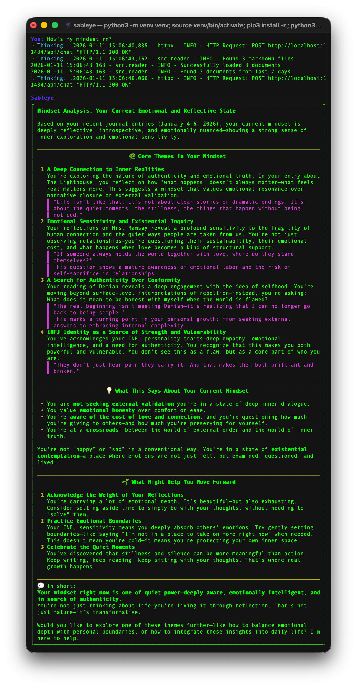

# Sableye

An AI agent that analyzes journaling notes in Obsidian to help structure personal goals and thoughts. Built with Python and LangChain.

LLM Configuration:
- **Provider**: `Ollama`
- **Model**: `qwen3:4b-instruct`



``` bash
python3 -m venv venv
source venv/bin/activate
pip install -r requirements.txt
python cli.py
```